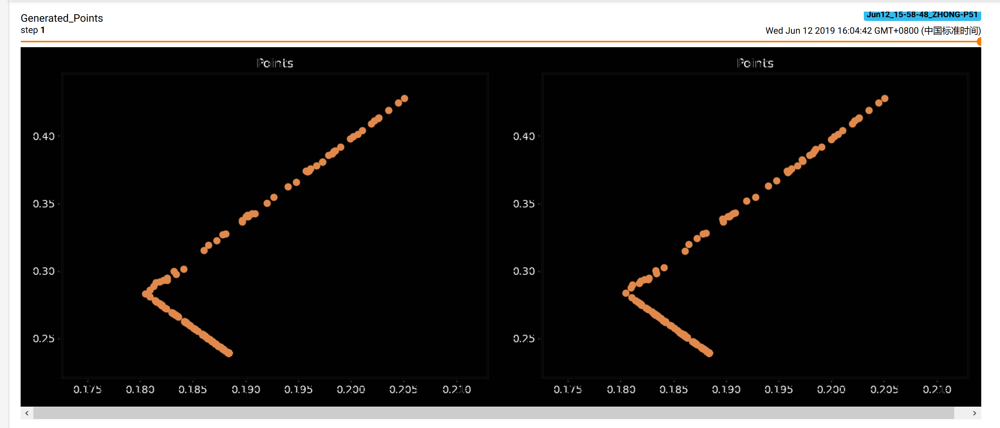
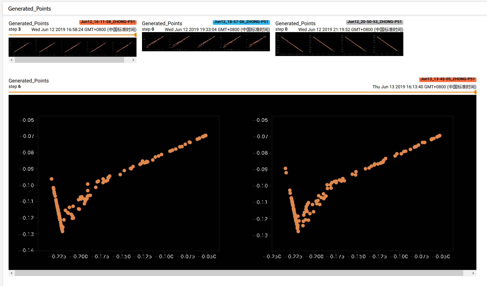

# Notes

Notes on testing the network.

### June 13 2019 16:18 CST

Commit `31ff6a1b6b8219397be4bbcbd2badbd3d9366c83`

I used matplotlib to plot the points generated by the network. The above result is relatively good. It looks like the number 7 after a rotation.

Currently, the experiment is hard to be continued for some reasons,

- Resource hungry: when I using GPU mode, if the batch size is set 5, the system will stop due to memory outage (32GB system RAM & 4GB VRAM).
- I guess the small batch size leads to the generated plots continue to be a same number (see the screenshot below, the numbers seem to be 1 and 7). Typically the batch size of MNIST dataset should be 10,000 or something.

  

- I checked implementations of *Non-Local Neural Network* on the Internet, most of the comments are about resource hungry, that means the non-local block requires relative more computation power.
- The relation module here (and implementation elsewhere) is implemented by nested loops. I think this will be the major reason that this network cannot run faster.
- One of my friends points out that the randomly selected 128 points is not reasonable.

Here are some plans to address the above problems,

- Add checkpoints for this model.
- Re-implement the relation module by referring FAIR's implementation on the *Non-Local Neural Network*.
- Change to the [RICO dataset](http://interactionmining.org/rico). Personally I am more interested in the performance on this dataset, and hopefully we can have less variable size in this dataset (some rectangles vs. 128 points each element).

### June 10 2019 22:29 CST

Commit `1d47db6d76cd20208822d38d4d10635d24f638af`

- Fixed bugs on generating zlist.
- Now the model seems *correct*.

### June 2 2019 14:09 CST

Commit `c7702b48117fc874281656907ca6921a87d3a789`

- Made another real loss function to fit the shapes.
- Now the training can be run.
- Analysis on this problem:
    - The code seems to made everything correct before initialize zlist.
    - From the article, **each image** extracts *128 random points*, but the generator generates tensor size equals to the batch size.
    - We need to figure out how to let the generator to generate a same shape as the real images.

### May 8 2019 11:00 CST

Commit `bd1f56e5da4471d836b3da6d18e7e86a3a198bc6`

- Disable batch norm layers and max pooling layers.
- Bypass the errors before.
- A new error in loss passing:
    - `Target size (torch.Size([15])) must be the same as input size (torch.Size([15, 128]))`
    - On `main.py`, `real_loss` and `fake_loss` methods.

### May 1 2019 22:30 CST

Commit `f7990a096dd61240d47e7ae382c9e4c920fc35a7`

**Some progress.**

- Figure out of memory issue: it IS because my VRAM is too small.
- FIXME
    - The fake images has the element num equals to batch size, consider to extract "element_num" parameter to other places.

### May 1 2019 17:00 CST

Commit `f3fe546f03ec3bb041d5af02d675a490b61e644d`

**Running failed**

- The program stopped due to out of memory issue.
- Guesses
    - The program consumes VRAM slowly may due to low efficient on the data set handling function.
    - The program run out of the VRAM and system RAM may due to the checkpoints were not saved automatically.
- Something to try
    - Parallelize the data set handling function.
    - Explore how PyTorch can save something automatically.